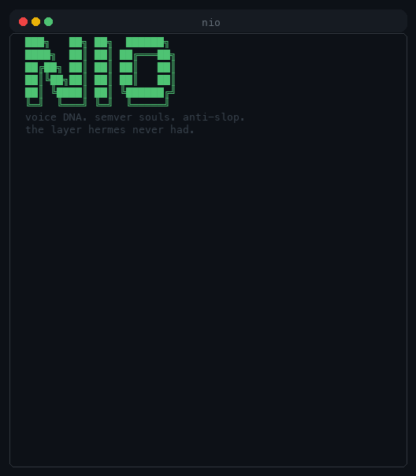

<p align="center">
  
</p>

<p align="center">
  <strong>Your CLI agent, accessible from anywhere.</strong>
</p>

<p align="center">
  <em>voice DNA. semver souls. anti-slop. remote chat.</em>
</p>

<p align="center">
  <a href="#install">Install</a> &bull;
  <a href="#what-nio-does">What It Does</a> &bull;
  <a href="#quick-start">Quick Start</a> &bull;
  <a href="#remote-access">Remote Access</a> &bull;
  <a href="#anti-slop">Anti-Slop</a> &bull;
  <a href="#souls">Souls</a> &bull;
  <a href="#persistent-memory">Memory</a> &bull;
  <a href="#architecture">Architecture</a> &bull;
  <a href="#license">License</a>
</p>

<p align="center">
  
  
  
  
  
  
</p>

---

## Install

```bash
curl -sSf https://nio.sh | bash
```

Or with pip:

```bash
pip install nio-agent
nio install
```

Then run the setup wizard:

```bash
nio setup
```

Five steps: mode selection, access (local or remote via Cloudflare tunnel), platform connections, memory import, and verification. Dashboard starts at `localhost:4242`. Remote access puts it on your phone.

## What NIO does

NIO wraps Claude Code with quality scoring, voice enforcement, persistent memory, and remote access. Run `nio start` on your Mac, open the chat from your phone.

- **Remote chat**: Talk to your Claude Code agent from your phone, tablet, or any browser. Cloudflare tunnel provides secure HTTPS without exposing ports.
- **Anti-slop scoring**: 29 patterns across 3 tiers catch AI writing tells before they ship. Every turn gets a 0-100 score.
- **Soul system**: Versioned personality prompts with semver, diff, and rollback. Treat your agent's behavior like software.
- **Voice profiles**: Tone rules, banned phrases, formatting constraints. Applied at runtime to every outbound message.
- **Persistent memory**: SQLite-backed session resume. New sessions carry context from previous ones automatically.
- **Dashboard**: `localhost:4242` with chat, quality scores, session history, memory browser, soul viewer, and platform connections.

Works standalone with Claude Code. Optionally bridges to [Hermes Agent](https://github.com/NousResearch/hermes-agent) for multi-platform messaging (Discord, WhatsApp, Telegram).

## CLI-first, no APIs

NIO runs entirely on your machine. No cloud service. No telemetry. No account.

SQLite is the single source of truth. Every session, every turn, every slop score lives in `~/.nio/nio.db`. You own the file. You can inspect it with any SQLite client, export it, back it up, or delete it.

The CLI is the primary interface. The dashboard at `localhost:4242` is a viewer, not a controller. Every action the dashboard shows can be done from the terminal. Every metric it displays comes from the same DB you can query directly.

Claude Code integration works the same way. NIO installs a skill and hooks that write to the same local DB. No sidecar process, no external endpoint.

## Remote access

NIO runs on your Mac. Cloudflare Tunnel makes it reachable from anywhere without opening ports or managing certs.

```bash
nio setup access     # choose local or remote
nio start            # boots tmux + dashboard + tunnel
```

The setup wizard handles everything: detecting cloudflared, authenticating, creating or selecting a tunnel, and binding to your domain. Two modes:

- **Custom domain**: Point `nio.yourdomain.com` at your tunnel. Stable URL, your brand.
- **Quick tunnel**: Auto-generated `.trycloudflare.com` URL. No config, but the URL changes on restart.

Once running, open `https://your-domain/chat` on your phone. The chat streams Claude Code responses in real-time via SSE, with session continuity across messages and slop scoring on every response.

```bash
nio stop             # kills tmux session + tunnel, dashboard stays up
```

The dashboard stays running via launchd. The tunnel and Claude Code session are the things that start and stop.

## Background

Extracted from 2.5 months of daily Claude Code work across 8 shipped repos. The patterns in NIO (structured handoffs, persistent memory, soul prompts, anti-slop scoring) were running in production before they were packaged here.

Prior work: [recursive-data-drift](https://github.com/shawnla90/recursive-data-drift) (context handoff engine), [shawn-gtme-os](https://github.com/shawnla90/shawn-gtme-os) (GTM coding agent, NIO's foundation), plus 4 full-stack websites shipped with these techniques.

## Hermes bridge

If you use [Hermes Agent](https://github.com/NousResearch/hermes-agent) for multi-platform messaging, NIO installs as a zero-patch plugin at `~/.hermes/hooks/nio/`. Your Discord, WhatsApp, and Telegram conversations get the same scoring, memory, and voice enforcement as your Claude Code sessions. `nio setup memory` imports your existing Hermes memories. You do not need Hermes to use NIO.

## Persistent memory

Sessions survive shutdown. When a new session starts, NIO summarizes the previous one and injects it into the system prompt. Your agent knows what it did last time, what you were working on, and the quality of its own output.

`nio setup memory` imports existing context from Hermes memories and Claude Code handoff documents, deduplicated by hash. The memory bridge is bidirectional.

## Quick start

```bash
# boot everything: animation + tmux + dashboard + tunnel
nio start

# what's running
nio status

# switch souls
nio soul apply nio-core

# check anti-slop score on a file
nio antislop check draft.md

# score inline text
nio antislop score "The uncomfortable truth is this game changer unleashes chaos."
# -> 12/100 (4 violations: authority_signaling, hype_words x3)

# open the dashboard
nio dash

# release a new soul version after tuning
nio soul release nio-core --bump minor --message "tightened slop floor to 95"

# diff two soul versions with metric deltas
nio soul diff nio-core@0.1.0 nio-core@0.2.0
```

## Architecture

Every outbound agent message passes through NIO middleware:

```
claude code (primary)             hermes gateway (optional)
      |                                |
      v                                v
  ~/.claude/skills/nio/         ~/.hermes/hooks/nio/
      |                                |
      +----------------+-----------------+
                       |
                NIO middleware
                |    |    |    |
                v    v    v    v
             soul  voice  slop  metrics
                |    |    |    |
                v    v    v    v
             ~/.nio/nio.db (SQLite + WAL)
                       |
                       v
                localhost:4242         ->  cloudflare tunnel  ->  your phone
              (FastAPI + Jinja2)            (optional HTTPS)       tablet, etc.
                  |        |
                  v        v
              dashboard   /chat
              (HTMX)     (SSE stream)
```

**5-event pipeline:**

| Event | What happens |
|---|---|
| `gateway:startup` | Init DB, load active soul + voice |
| `session:start` | Resolve soul (team-aware by cwd), inject prompts |
| `agent:start` | Record user message, start latency timer |
| `agent:end` | Apply voice, score slop, record turn, emit to dashboard |
| `command:*` | Handle `/nio-status`, `/nio-soul`, `/nio-dash` |

## Souls

Markdown + YAML frontmatter. Human-editable. Version-controlled. Diffable.

```yaml
---
soul: nio-core
version: 0.2.0
voice: shawn-builder@1.0.0
targets:
  slop_score_floor: 92
  latency_p50_ms: 2000
antislop:
  profile: strict
---

# NIO Core

[prompt body loaded verbatim into the system prompt]
```

Version your souls like software:

```bash
nio soul release nio-core --bump minor --message "tightened slop floor"
nio soul diff nio-core@0.1.0 nio-core@0.2.0
nio soul checkout nio-core@0.1.0
```

`nio soul diff` shows the prompt body diff alongside metric deltas (slop avg, p50 latency, user signal, session count) between versions.

Souls support inheritance via `derived_from`. Child soul merges voice, anti-slop overrides, targets, and prompt body from parent. Cycles detected and rejected.

**Starter souls:** `nio-core` (daily driver) and `nio-reviewer` (PR review + anti-slop enforcer).

## Anti-Slop

Single JSON registry at `registry/anti-slop.json`. 29 patterns across three tiers:

| Tier | Count | Weight | Examples |
|---|---|---|---|
| **critical** | 20 | 3x | em-dashes, authority signaling, hype words, sycophantic openers |
| **context** | 5 | 1.5x | engagement bait, false dichotomies (OK in some contexts) |
| **natural** | 4 | 0x | ellipses, arrows, emoji markers (your actual voice, not slop) |

**Score formula:**

```
score = 100 - sum(severity * tier_weight * count) / tokens * 100
clamped [0, 100]
```

One registry generates validators for both languages:

```bash
nio antislop sync
# -> nio/core/antislop.py        (Python, baked-in rules)
# -> treadit/src/lib/ai/anti-slop.ts  (TypeScript, full module)
# -> docs/anti-slop-reference.md      (human-readable)
```

No more drift between implementations.

## Voice DNA

Voice profiles define tone, banned phrases, anti-slop rule subsets, and formatting rules. Independent from souls. Souls pin a voice at a specific version.

**Included profiles:**
- `shawn-builder` . builder-first, casual competence, SDR-to-GTME arc
- `enterprise-neutral` . professional, clean, no personal brand elements

```bash
nio voice apply shawn-builder
nio voice diff shawn-builder@1.0.0 shawn-builder@1.1.0
```

Runtime `apply()` runs on every outbound message:
1. Hard reject on banned phrases
2. Anti-slop validation with the voice's rule set
3. Preferred phrasing advisories (to dashboard, not inline edits)

## Dashboard

`localhost:4242`. Autostarted via launchd on install. Dark theme. Big numbers. Accessible remotely via Cloudflare tunnel.

**Pages:**
- **Home** . active soul, voice, live slop gauge, session/turn counts, platform status
- **Chat** . talk to your agent from the browser, SSE streaming, slop-scored responses, session resume
- **Soul** . active soul viewer, version history, diff
- **Memory** . browsable memory entries by source, paginated
- **Sessions** . full session history with turn counts and slop averages
- **Metrics** . slop scores by version, latency time series, task distribution
- **Connections** . platform status grid, Hermes hook, Claude Code skill
- **Learn** . onboarding and reference

Stack: Python, FastAPI, Jinja2, HTMX, Alpine, Chart.js. No npm build step. Single process.

## Team mode

Drop a `.nio/team.toml` in any repo:

```bash
nio team init --name my-team
# collaborators run:
nio team join github.com/org/repo
```

When a collaborator enters the repo directory, NIO auto-activates the team soul.

- **Git-backed memory** . shared context at `.nio/memory/`
- **Owner-controlled releases** . `nio team release` with permission enforcement
- **Trust model** . pin voice profiles (soul signing planned for v0.2)

## CLI

```
nio start                              # boot animation + tmux + dashboard + tunnel
nio stop                               # kill session + tunnel (dashboard stays)
nio status                             # what's running
nio doctor                             # diagnostics

nio setup [mode|access|platforms|memory|verify]
nio install [--migrate-hermes]

nio soul list|show|create|edit|release|diff|checkout|apply|active
nio voice list|show|apply|diff|release
nio antislop check|score|sync|list
nio metrics show|export|team
nio team init|join|sync|members|release
nio cc start|turn|end|status|context
nio dash [start|stop]
nio gateway [start|discord|whatsapp]
```

## Why SQLite

NIO stores everything in a single SQLite database at `~/.nio/nio.db`.

- **WAL mode**: Concurrent reads while the middleware writes. The dashboard queries metrics while Hermes records turns. No locks, no contention.
- **Crash-safe**: WAL + ACID transactions mean a power failure mid-session does not corrupt your data. The last committed turn is always intact.
- **Zero-config**: No database server. No connection strings. No Docker. `nio install` creates the file; that is the entire setup.
- **Single file**: Back up your entire NIO history by copying one file. Restore it by putting it back. Move it to another machine. It just works.
- **Append-only audit trail**: Every turn is a row. Every slop score is recorded. Nothing gets overwritten. You can query your full agent history with plain SQL.
- **Schema migrations versioned**: `nio/core/db.py` tracks a `SCHEMA_VERSION`. Upgrades are idempotent ALTER TABLE statements, not destructive rebuilds.

## Why modular

NIO is a set of independent systems that compose, not a monolith.

- **Souls are markdown + YAML**. Human-editable, diffable, version-controllable. No proprietary format. Your text editor is the soul editor.
- **Voices are independent from souls**. A soul pins a voice at a specific version. Upgrade a voice without touching any soul. Swap voices across souls.
- **Anti-slop registry generates validators**. One JSON file produces Python, TypeScript, and Markdown. Your web app and your agent use the same rules from the same source.
- **Team mode is a directory convention**. Drop `.nio/team.toml` in a repo. Collaborators run `nio team join`. No server, no admin panel.
- **Hermes plugin is zero-patch**. NIO installs as a hook. The Nous Research fork is unchanged. When Hermes ships updates, NIO stays compatible.
- **Claude Code integration is a skill + hooks**. Same pattern. When Claude ships features, NIO wires them in through the existing hook system.

## Persistent memory

Sessions survive shutdown. New sessions carry context from previous ones.

**Session resume chain:**

```
ended session
  -> summarize (first user msg + last agent msg + task type + slop avg)
  -> store as context_snapshot in new session row
  -> inject summary into system prompt via nio_memory_context
```

Every new session knows what the previous session did, what it was working on, and how clean the output was. The chain is queryable: `sessions.resumed_from` links back to the parent session.

**Memory bridge:**

`nio setup memory` imports existing Hermes memories from `~/.hermes/memories/MEMORY.md` and `USER.md`. Paragraphs are split, deduplicated by SHA-256 hash, and stored in the `memory_context` table. `sync_back_to_hermes()` writes NIO context back to the Hermes memory files. Bidirectional. No data loss.

## Data transparency

**What gets recorded per turn:**

```json
{
  "turn_id": "a1b2c3",
  "session_id": "x9y8z7",
  "turn_index": 3,
  "user_msg": "fix the auth middleware",
  "agent_msg": "I've updated the token validation...",
  "latency_ms": 1847,
  "slop_score": 94.2,
  "slop_violations": [{"id": "em_dashes", "tier": "critical", "matches": 1}],
  "tool_calls": ["Read", "Edit"],
  "memory_hits": 2,
  "created_at": "2026-04-05T22:30:00Z"
}
```

**What does not get recorded**: file contents, environment variables, API keys, system prompts, anything outside the agent conversation flow.

**Inspect your data:**

```bash
# Export all metrics as JSON
nio metrics export --format json

# Query the DB directly
sqlite3 ~/.nio/nio.db "SELECT slop_score, created_at FROM turns ORDER BY created_at DESC LIMIT 10"

# Delete everything
rm ~/.nio/nio.db
# NIO recreates the schema on next start. No orphaned state.
```

## Data

All runtime state lives at `~/.nio/`:

```
~/.nio/
  bin/nio          CLI symlink
  venv/            isolated Python environment
  nio.db           SQLite (sessions, turns, soul/voice versions, team state)
  config.yaml      mode, access (local/remote + tunnel), dash port, telemetry
  active/          current soul.txt + voice.txt + soul-prompt.md
  teams/           joined team manifests
  logs/            dash stdout/stderr
  cache/           temporary files
```

Separate from Hermes state. Clean uninstall.

## License

MIT

---

<p align="center">
  <sub>built by <a href="https://github.com/shawnla90">shawn</a> . made by pi</sub>
</p>
